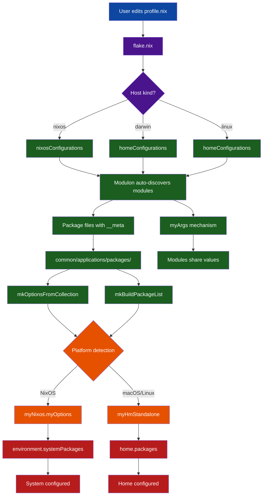

# Architecture Overview

This document describes the architecture and core subsystems of the NixOS flake.

## Table of Contents

- [Directory Structure](#directory-structure)
- [Host Types](#host-types)
- [Core Subsystems](#core-subsystems)
  - [Self-Describing Package Modules](#self-describing-package-modules)
  - [Module Arguments (myArgs)](#module-arguments-myargs)
  - [Platform Abstraction](#platform-abstraction)
  - [Profile Engine](#profile-engine)
  - [Multi-Channel Support](#multi-channel-support)
  - [Home Manager State Version](#home-manager-state-version)
- [System Architecture Diagram](#system-architecture-diagram)

---

## Directory Structure

```
.
├── config/
│   ├── hosts/                    # Host-specific profiles
│   │   ├── desktop/              # NixOS host
│   │   ├── maru/                 # macOS host
│   │   └── tenten/               # macOS host
│   ├── nixos/
│   │   └── modules/              # NixOS modules
│   │       └── applications/
│   │           └── packages/     # NixOS package module wrapper
│   ├── home-manager/
│   │   └── modules/              # Home Manager modules
│   │       └── packages/         # HM package assembly
│   └── common/                   # Shared logic
│       ├── applications/         # Shared application configurations
│       │   ├── packages/         # Package lists & assembly logic
│       │   │   ├── baseline.nix
│       │   │   ├── cli.nix
│       │   │   ├── gui.nix
│       │   │   └── ...
│       │   ├── bat.nix
│       │   ├── fzf.nix
│       │   ├── starship.nix
│       │   ├── tmux.nix
│       │   ├── yazi.nix
│       │   └── zoxide.nix
│       └── options/              # Shared option schemas
├── flake.nix                     # Flake entry point
├── flake/                        # Flake components
│   ├── hosts.nix                 # Host definitions
│   ├── channel-inputs.nix        # Channel input processing
│   ├── builders.nix              # Configuration builders
│   └── checks.nix                # CI/CD validation
└── secrets/                      # Encrypted secrets
```

### Common Directory

The `config/common/` directory contains shared logic and configurations that are used across both NixOS and Home Manager:

- **`applications/packages/`** - Package lists (baseline.nix, cli.nix, gui.nix, etc.) and assembly logic used by both NixOS and Home Manager
- **`applications/`** - Shared application configurations (bat, fzf, starship, tmux, yazi, zoxide) that ensure consistent settings across platforms
- **`options/`** - Shared option schemas for Home Manager standalone
- **`overlays/`** - Nixpkgs overlays

This enables **single source of truth** for application settings - define once in `common/`, use everywhere.

---

## Host Types

Hosts are defined in `flake/hosts.nix` with a `kind` attribute:

```nix
hosts = {
  desktop = {
    kind = "nixos";
    channel = "stable";
    system = "x86_64-linux";
  };
  maru = {
    kind = "darwin";
    system = "aarch64-darwin";
  };
  tenten = {
    kind = "darwin";
    system = "aarch64-darwin";
  };
};
```

---

## Core Subsystems

### Self-Describing Package Modules

Package files export their own metadata via `__meta`, enabling automatic option generation:

```nix
# config/build/shared/modules/applications/packages/cli.nix
{
  pkgs,
  pkgs-unstable,
  isDarwin ? false,
  ...
}:
{
  __meta = {
    optionPrefix = "cli";
    description = "CLI tools and applications";
    hasSubcategories = true;  # Generates _all flag
  };

  ai = with pkgs-unstable; [ aichat ];
  backup = with pkgs-unstable; [ borgbackup ];
  # ... more categories
}
```

**Benefits:**
- Add a new category by creating a file with `__meta`
- Options are auto-generated from the file structure
- `_all` flags are created automatically for files with subcategories

### Module Arguments (myArgs)

The `myArgs` mechanism allows modules to share values without conflicts:

```nix
# Producer module (packages/default.nix)
myNixos.myArgsContributions.packages = {
  pkgs = pkgs;
  pkgs-unstable = pkgs-unstable;
};

# Consumer module (any other module)
{ myArgs, ... }:
{
  myNixos.myOptions.packages.modulePackages = with myArgs.packages.pkgs-unstable; [
    some-package
  ];
}
```

This solves the NixOS limitation where `_module.args` can't be defined by multiple modules.

### Platform Abstraction

A unified configuration accessor works across NixOS and standalone Home Manager:

```nix
# config/build/home-manager/modules/common/platform-config.nix
let
  cfg = if nixosConfig != null
        then nixosConfig.myNixos.myOptions
        else config.myHmStandalone;
in
{
  # Access cfg.flakeSrcPath, cfg.secrets.*, etc.
  # Works identically on NixOS and macOS
}
```

### Profile Engine

The profile engine provides a **single source of truth** for host configuration through simple declarative profiles. Instead of digging through complex module hierarchies, users configure everything in one place:

```nix
# NixOS host profile
{ ... }:
{
  myNixos.myOptions = {
    flakeSrcPath = "/home/user/monster-flake";
    cli.editor = "nvim";
    packages = {
      baseline = true;
      cli._all = true;
      gui = false;
      guiShell = {
        kde = true;
        # Auto-generates: guiShell._all = false
      };
    };
    programs = {
      atuin.enable = true;
      git.enable = true;
    };
  };
}

# macOS host profile (identical structure)
{ config, ... }:
{
  myHmStandalone = {
    flakeSrcPath = "${config.home.homeDirectory}/monster-flake";
    cli.editor = "nvim";
    packages = {
      baseline = true;
      cli._all = true;
      # Platform awareness automatically filters packages
    };
    programs = {
      atuin.enable = true;
      git = {
        enable = false;
        lfs.enable = true;
      };
    };
  };
}
```

**Key benefits:**
- **Unified interface** — Same structure works across NixOS, macOS, and GNU/Linux
- **Zero boilerplate** — No complex module imports or wiring
- **Auto-discovery** — Options are generated from package file `__meta`
- **Platform aware** — `isDarwin` flag automatically filters platform-specific packages
- **Extensible** — Add new options to the profile without touching other files

### Multi-Channel Support

Each host can independently use stable or unstable channels:

```nix
desktop = {
  channel = "stable";   # Uses nixos-25.11
  # ...
};

laptop = {
  channel = "unstable"; # Uses nixos-unstable
  # ...
};
```

Third-party flake inputs are automatically normalized — modules reference `_inputs.home-manager` regardless of channel.

### Home Manager State Version

The flake uses a centralized `hmStateVersion` variable to manage Home Manager state versions consistently across all hosts:

```nix
# flake.nix
let
  # Home Manager state version - single source of truth, overridable per-host/user
  hmStateVersion = "25.11";
```

**Key features:**
- **Single source of truth** - Defined once, applied everywhere
- **Automatic application** - Passed to all Home Manager configurations
- **Per-host override capability** - Individual hosts can specify their own version
- **Platform agnostic** - Works identically on NixOS, macOS, and GNU/Linux

See [Home Manager State Version](05-HOME-MANAGER-STATE.md) for detailed usage guidelines and migration procedures.
See [Modulon Integration](10-MODULON.md) for automatic module discovery details.

---

## System Architecture Diagram



**Flow explanation:**
1. **User** edits their host profile in `profile.nix`
2. **Flake** determines host kind and loads appropriate configuration
3. **Modulon** auto-discovers all modules without manual imports
4. **Package files** declare themselves via `__meta` attributes
5. **Shared logic** generates options and builds package lists
6. **Platform detection** routes to NixOS or Home Manager
7. **myArgs mechanism** allows modules to share values
8. **System** is configured with packages and settings
