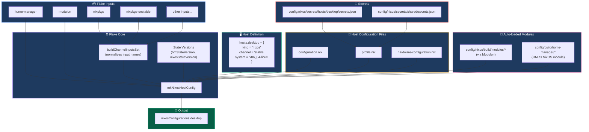
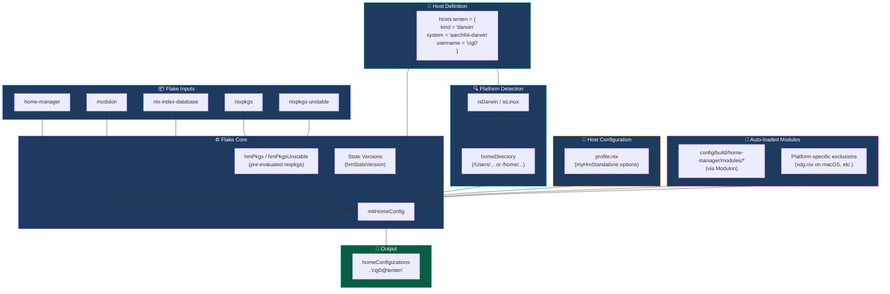
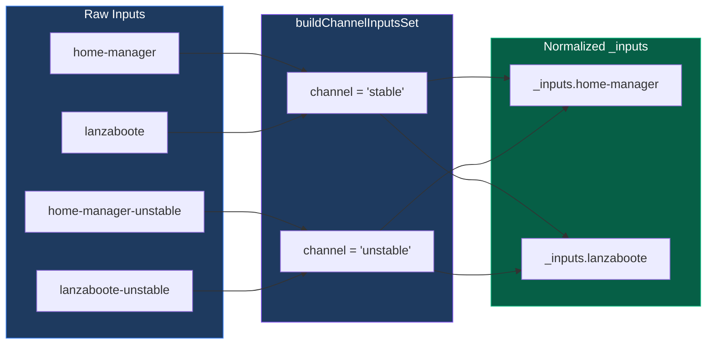

# Understanding flake.nix

This document provides a comprehensive guide to the `flake.nix` file structure, the central configuration hub for this NixOS multi-host and multi-channel setup.

## Overview

The `flake.nix` acts as a centralized framework to manage NixOS, macOS, and standard GNU/Linux hosts. It leverages the Modulon automatic module loader library for zero-friction extensibility.

## Architecture Diagrams

### NixOS Host Build Flow



### Home Manager Standalone Build Flow (macOS/Linux)



### Channel Input Processing



### Diagram Color Scheme

The Mermaid diagrams use a consistent color scheme to help visually distinguish different components:

| Color | Hex | Component Type |
|-------|-----|----------------|
| 🔵 **Blue** | `#3b82f6` | Flake Inputs (nixpkgs, home-manager, etc.) |
| 🟣 **Purple** | `#8b5cf6` | Flake Core processing (builders, normalization) |
| 🟢 **Green** | `#10b981` | Host definitions & final outputs |
| 🟠 **Orange** | `#f59e0b` | Host configuration files (profile.nix, etc.) |
| 🩷 **Pink** | `#ec4899` | Auto-loaded modules (via Modulon) |
| 🔴 **Red** | `#ef4444` | Secrets and sensitive configuration |
| 🩵 **Cyan** | `#06b6d4` | Platform detection and system-specific logic |

All subgraphs use a dark background (`#1e3a5f`) with white text for consistency and readability.

## File Structure

The flake is split into modular components for easier management:

```
flake.nix                      # Main entry point (~350 lines)
├── inputs                     # External dependencies
├── outputs                    # Imports and wires components together
│
flake/                         # Flake components directory
├── hosts.nix                  # Host definitions (desktop, tuxedo, maru, tenten)
├── channel-inputs.nix         # Channel input processing and normalization
├── builders.nix               # mkNixosHostConfig and mkHomeConfig builders
└── checks.nix                 # CI/CD validation checks
```

### Component Responsibilities

| File | Purpose |
|------|---------|
| `flake.nix` | Inputs, state versions, pre-evaluated pkgs, imports components |
| `flake/hosts.nix` | Host definitions with kind, channel, system, username |
| `flake/channel-inputs.nix` | `buildChannelInputsSet` function for input normalization |
| `flake/builders.nix` | `mkNixosHostConfig` and `mkHomeConfig` configuration builders |
| `flake/checks.nix` | `mkChecks` for CI/CD validation |

---

## Inputs Section

### Nixpkgs Channels

```nix
nixpkgs.url = "github:NixOS/nixpkgs/nixos-25.11";        # Stable channel
nixpkgs-unstable.url = "github:NixOS/nixpkgs/nixos-unstable";  # Unstable channel
```

### Dual-Channel Input Pattern

Most third-party inputs follow a dual-channel pattern for flexibility:

```nix
# Stable version (follows nixpkgs)
some-input = {
  inputs.nixpkgs.follows = "nixpkgs";
  url = "github:owner/repo/v1.0.0";
};

# Unstable version (follows nixpkgs-unstable)
some-input-unstable = {
  inputs.nixpkgs.follows = "nixpkgs-unstable";
  url = "github:owner/repo";
};
```

This pattern allows hosts to choose their release channel while maintaining consistent input versions.

### Key Inputs

| Input | Purpose |
|-------|---------|
| `home-manager` | User-specific packages and dotfile management |
| `agenix` | Age-encrypted secrets for NixOS |
| `lanzaboote` | Secure Boot support |
| `modulon` | Automatic module loader framework |
| `nix-index-database` | Pre-built package search database |
| `nixvim` | Neovim configuration system |

---

## Outputs Section

### State Versions

```nix
# State versions - single source of truth, overridable per-host/user
hmStateVersion = "25.11";
nixosStateVersion = "25.11";
```

These variables provide centralized control over state versions for all hosts:
- **`hmStateVersion`** - Home Manager state version, passed to all HM configurations
- **`nixosStateVersion`** - NixOS state version, passed via `specialArgs` to all NixOS modules

**Why centralize?** Ensures consistency across all hosts and simplifies version upgrades.

### Supported Systems

```nix
supportedSystems = [
  "x86_64-linux"
  "aarch64-linux"
  "x86_64-darwin"
  "aarch64-darwin"
];
```

### Channel Input Processing

> **Location:** `flake/channel-inputs.nix`

The `buildChannelInputsSet` function normalizes input names by stripping channel suffixes:

```nix
# In modules, reference inputs without suffix:
_inputs.home-manager    # Not home-manager-unstable
_inputs.lanzaboote      # Not lanzaboote-unstable
```

This allows modules to be channel-agnostic while the flake handles version selection.

---

## Host Configuration Builders

> **Location:** `flake/builders.nix`

### mkNixosHostConfig

Creates NixOS system configurations with:
- Channel-specific nixpkgs and inputs
- Home Manager as a NixOS module
- Modulon-powered automatic module loading from `config/nixos/build/modules/`
- Host-specific profile and configuration files

**specialArgs passed to modules:**
- `hmStateVersion` - Home Manager state version
- `nixosStateVersion` - NixOS state version
- `libModulon` - Modulon library functions
- `libAnsiColors` - ANSI color utilities
- `_inputs` - Normalized channel-specific inputs
- `self` - Flake self-reference

### mkHomeConfig

Creates Home Manager standalone configurations for non-NixOS hosts (macOS, generic Linux):
- Platform detection (`isDarwin`, `isLinux`)
- Automatic home directory resolution
- Modulon-powered module loading from `config/build/home-manager/modules/`
- Platform-specific module exclusions

---

## Hosts Definition Block

> **Location:** `flake/hosts.nix`

```nix
hosts = {
  # NixOS hosts
  desktop = {
    kind = "nixos";
    description = "Desktop: Intel CPU, Nvidia GPU + KDE";
    channel = "stable";
    system = "x86_64-linux";
    username = "cig0";
    extraModules = [ ];
  };

  # macOS hosts (Home Manager standalone)
  tenten = {
    kind = "darwin";
    description = "macOS host: MacBook Air M4";
    system = "aarch64-darwin";
    username = "cig0";
    extraModules = [ ];
  };
};
```

### Host Configuration Options

| Option | Description |
|--------|-------------|
| `kind` | Host type: `nixos`, `darwin`, or `linux-generic` |
| `description` | Human-readable host description |
| `channel` | Release channel: `stable` or `unstable` (NixOS only) |
| `system` | Target architecture (e.g., `x86_64-linux`, `aarch64-darwin`) |
| `username` | Primary user account |
| `extraModules` | Additional NixOS/HM modules to include |

---

## Flake Outputs

### nixosConfigurations

Generated for all hosts with `kind = "nixos"`:

```nix
nixosConfigurations = builtins.mapAttrs mkNixosHostConfig (filterHostsByKind "nixos");
```

Build with: `nixos-rebuild switch --flake .#hostname`

### homeConfigurations

Generated for non-NixOS hosts (`darwin` or `linux-generic`):

```nix
homeConfigurations = {
  "username@hostname" = mkHomeConfig hostname hostConfig;
};
```

Build with: `home-manager switch --flake .#username@hostname`

### checks

> **Location:** `flake/checks.nix`

Flake checks for CI/CD validation:
- `eval-nixos-*` - NixOS configuration evaluation
- `build-nixos-*` - NixOS system build
- `eval-hm-*` - Home Manager configuration evaluation
- `build-hm-*` - Home Manager activation package build

Run with: `nix flake check`

---

## Key Design Patterns

### 1. Single Source of Truth

- State versions defined once, used everywhere
- Package definitions shared across platforms
- Module defaults in `config/nixos/build/modules/`, overrides in `profile.nix`

### 2. Channel Flexibility

- Each host chooses its release channel independently
- Inputs automatically resolve to channel-appropriate versions
- Mix stable system with unstable packages when needed

### 3. Modulon Integration

Automatic module discovery eliminates manual imports:

```nix
(libModulon {
  dirs = [ "${self}/config/nixos/build/modules" ];
})
```

### 4. Separation of Concerns

- `flake.nix` - Inputs, state versions, component imports
- `flake/` - Modular flake components (hosts, builders, checks)
- `profile.nix` - Host-specific toggles and overrides
- `configuration.nix` - System state (filesystems, boot)
- `hardware-configuration.nix` - Hardware-specific settings

---

## Adding a New Host

1. Add host definition to `flake/hosts.nix`
2. Create `config/build/hosts/<hostname>/profile.nix`
3. For NixOS: add `configuration.nix` and `hardware-configuration.nix`
4. For secrets: create `config/nixos/secrets/hosts/<hostname>/secrets.json`

See [Adding Hosts](04-ADDING-HOSTS.md) for detailed instructions.

---

## Troubleshooting

### Input Not Found

Ensure the input follows the dual-channel naming convention and is properly declared in the `inputs` block.

### Module Not Loading

Check that the module is in the correct directory (`config/nixos/build/modules/` or `config/build/home-manager/modules/`) and doesn't have a `@MODULON_SKIP` annotation.

### State Version Mismatch

State versions are centralized in `flake.nix`. Update `hmStateVersion` or `nixosStateVersion` there, not in individual host configurations.
